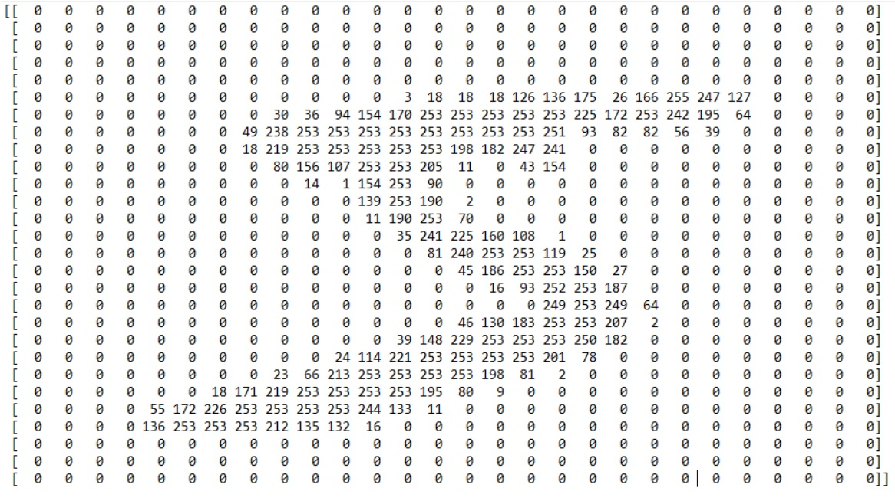

# MNIST
> The purpose of the project was to create a neural network that could categorize handwritten digits into one of ten classes.

## What is MNIST?
MNIST is a dataset containing 70,000 handwritten digits splited into training data (60,000) and test data(10,000). All images were scaled to 28x28px and are grayscale with intensity in range of 0-255.

## Screenshots

*Sample images from MNIST dataset*

*Sample image tensor from MNIST dataset*
## Technologies
* Python - version 3.8.3
* Numpy - version 1.18.5
* Pandas - version 1.0.5
* PyTorch - version 1.7.0 CUDA 10.1
* TorchVision - version 0.8.1 CUDA 10.1
* PyTorch-Lightning - version 1.0.6
* Scikit-Learn - version 0.23.1

